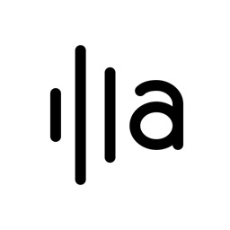
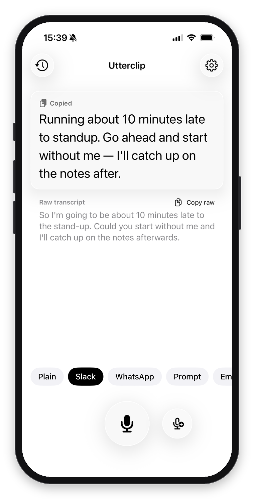
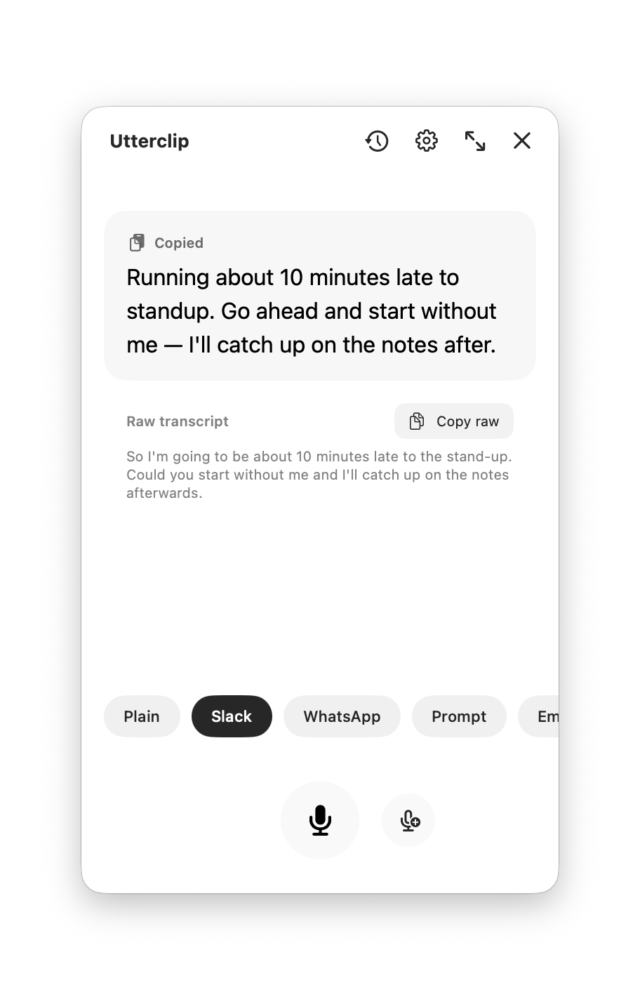
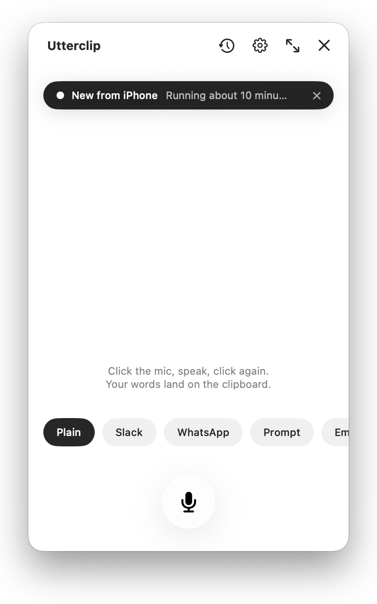

<p align="center">
  
</p>

<h1 align="center">Utterclip</h1>

<p align="center">
  <strong>Dictate, and polished text lands on your clipboard.</strong><br>
  <strong>For iPhone and Mac.</strong> Tap the mic, speak, tap again. Your words are transcribed on the
  device and rewritten as the message you were about to type — a Slack update, a WhatsApp reply,
  an email, a prompt. On the Mac it lives in the menu bar, in one small window that floats above
  whatever you are writing in.
</p>

<p align="center">
  <a href="https://apps.apple.com/app/id6809807393"><strong>Download on the App Store</strong></a> ·
  <a href="#install-without-the-app-store">Install without the App Store</a> ·
  <a href="#utterclip-for-mac">Utterclip for Mac</a> ·
  <a href="#privacy">Privacy</a> ·
  <a href="#faq">FAQ</a>
</p>

<p align="center">
  
  
  
  
  
</p>

<p align="center">
  
  &nbsp;&nbsp;
  
</p>
<p align="center"><sub>Left: iPhone. Right: the Mac app, one window that floats above whatever you write in.</sub></p>

---

## Why Utterclip

Typing on a phone is slow. Talking is fast. But what comes out of a dictation is not what you would
send: it has filler words, no punctuation, and the shape of speech rather than the shape of a message.

Utterclip closes that gap in one tap:

1. **You speak.** Tap the mic, say what you mean, tap again (or stop talking; it notices).
2. **It transcribes on your phone.** No audio ever leaves the device.
3. **The raw text is on your clipboard instantly.** You can paste it before anything else happens.
4. **It rewrites the text in the style you pick** and copies that instead. Slack, WhatsApp, Email,
   Prompt, or Plain (just auto-correct). Change your mind, tap another style, paste again.

Switch to Slack, WhatsApp, Mail, or your AI assistant and paste. That is the whole app.

Utterclip is for people who send a lot of short written messages and would rather say them:
the status update to your team from the train, the reply to a friend while walking, the well-formed
prompt for an AI assistant that you would never bother to type out on a phone keyboard.

**What it is not:** a notes app, a meeting recorder, or a chat bot. It never answers your
transcript, only rewrites it. There is no account, no subscription, and no server of ours.

---

## Features

**Dictation**
- **On-device transcription** with [WhisperKit](https://github.com/argmaxinc/WhisperKit) and
  OpenAI's multilingual Whisper `small` model (Argmax's quantized 216 MB build). The language is
  detected automatically from roughly 99 that Whisper knows; English and German are the two the
  app is tested with. No toggle.
- **Instant clipboard**: the raw transcript is pasteable before any rewrite starts.
- **Hands-free stop**: once you have started talking, five seconds of silence ends the recording.
- **Continue dictating**: append to what you just said; the rewrite re-runs on the whole text.
- **Live waveform** while recording, haptics on start, stop and save.

**Rewriting**
- **Five built-in styles**: Plain (fix grammar and filler only, keep your wording), Slack,
  WhatsApp, Prompt (structured as *The job / The why / The guardrails / Done means*), Email.
- **Make them yours**: edit any prompt, rename or delete the defaults (restorable), add your own.
  Up to seven styles. The pills above the mic pick the style for the next recording; the
  Settings default is just the starting selection.
- **Two engines**, your choice:
  - **Cloud**, with your own API key. Paste one key and the provider is detected from it:
    Anthropic, OpenAI, Google Gemini, or Groq. Fast, inexpensive models are used for each.
  - **On device**, with Apple's Foundation Models on iOS 26 with Apple Intelligence.
    No key, nothing leaves the phone. Quality is a notch below the cloud models; best for
    Plain and light restyling.
- **Never answers you**: a question in your transcript stays a question. A strict rewrite-only
  contract sits in front of every style prompt.
- **Same language in, same language out.** A German dictation gets a German Slack message, even
  though the style is called "Slack".

**Everything around it**
- **Sync with iCloud** (iPhone ↔ Mac): History, your rewrite styles, settings and the API key
  follow you between devices, inside your own iCloud account and encrypted by Apple. One
  switch in Settings turns it off; then everything stays on the device.
- **Privacy redaction** (cloud engine, on by default): emails, phone numbers, links and addresses
  are swapped for placeholders before the text is sent, and restored in the result.
- **History** of past dictations with one-tap restore and re-copy.
- **Editor** for quick fixes. Fix the result and it is re-copied; fix the transcript and the
  rewrite re-runs on the corrected text.
- **Markdown or plain text** copy mode, sticky until you switch it back.
- **Widget and Control**: a Home Screen widget, a circular Lock Screen widget, and an iOS 18
  Control Center control (also assignable to the Action button) that open the app straight into
  a recording.
- **Minimal, monochrome, native.** Black and white, system fonts and symbols, Liquid Glass on
  iOS 26 with a material fallback on iOS 17 to 25. Dark Mode follows the system.

---

## Get Utterclip

**App Store**: [Download on the App Store](https://apps.apple.com/app/id6809807393) — the
listing goes live with version 1.0; until then the link shows Apple's "not available" page.

Utterclip is free and open source. The app itself costs nothing. If you use the cloud rewrite
engine you pay your AI provider directly for what you use, which for short messages is a few
cents a month. The on-device engine costs nothing at all.

### Requirements

| | |
|---|---|
| **iPhone** | iOS 17 or later |
| **On-device rewriting** | iOS 26 with Apple Intelligence enabled (iPhone 15 Pro or later) |
| **Control Center control** | iOS 18 or later |
| **Cloud rewriting** | An API key from Anthropic, OpenAI, Google Gemini, or Groq |
| **First launch** | Internet access to download the Whisper model once (about 220 MB, Wi-Fi recommended) |
| **Sync between devices** | Optional. An iCloud account signed in on each device; iCloud Keychain on for the API key to travel. Works even where iCloud Drive is switched off |

### First run

1. **Let the model download.** On first launch Utterclip fetches the Whisper `small` model from
   Hugging Face and caches it on the device. You can record while it loads; afterwards it warm-loads
   in the background at every launch.
2. **Choose a rewrite engine** in Settings (the gear icon). Either paste an API key under
   **AI provider API key**, or turn on **Rewrite engine → Rewrite on device (Apple Intelligence)**.
   Without either you still get the raw transcript on the clipboard after every recording.
   With iCloud sync on, a key entered on one device shows up on your others.
3. **Pick your starting style** under **One-tap rewrite**. Plain is the default; the pills above
   the mic change it for any recording.
4. Optional: add the **Dictate** widget to your Home Screen or Lock Screen, or the **Dictate**
   control to Control Center or the Action button (iOS 18).

### Getting an API key

You only need one. Utterclip detects the provider from the key's prefix.

| Provider | Where to get a key | Model used |
|---|---|---|
| Anthropic | [console.anthropic.com](https://console.anthropic.com) | Claude Haiku 4.5 |
| OpenAI | [platform.openai.com](https://platform.openai.com/api-keys) | GPT-5 mini |
| Google Gemini | [aistudio.google.com](https://aistudio.google.com/apikey) | Gemini 2.5 Flash |
| Groq | [console.groq.com](https://console.groq.com/keys) | Llama 3.3 70B |

The key is stored in the iPhone's Keychain and is only ever sent to that provider, in a request
header. Utterclip has no server of its own and never sees your key or your text.

---

## Install without the App Store

Utterclip is open source, so you do not have to wait for (or use) the App Store. You need a Mac
with Xcode; a free Apple ID is enough for your own iPhone.

### Option A: build it yourself with Xcode

1. **Install the tools.**
   - [Xcode 26](https://developer.apple.com/xcode/) or later from the Mac App Store (includes the iOS 26 SDK).
   - [mise](https://mise.jdx.dev), which pins the [Tuist](https://tuist.dev) version that generates the project:
     ```sh
     curl https://mise.run | sh
     ```
2. **Clone and generate the project.**
   ```sh
   git clone https://github.com/ralfchille/utterclip-app.git
   cd utterclip-app
   mise exec tuist@4.200.5 -- tuist generate
   ```
   This resolves the Swift packages and opens `Utterclip.xcworkspace` in Xcode.
3. **Sign it with your own Apple ID.** In `Project.swift`, change `DEVELOPMENT_TEAM` to your
   team and the `bundleId` values to identifiers of your own (for example
   `com.yourname.utterclip`, `com.yourname.utterclip.core`, `com.yourname.utterclip.widgets`),
   then run `tuist generate` again. The checked-in values belong to the original author's account
   and will not sign for you.
4. **Run it on your iPhone.** Plug the phone in, select it as the run destination, choose the
   **Utterclip** scheme, and press Run. The first time, unlock the phone and trust your developer
   certificate under **Settings → General → VPN & Device Management**.

Notes for sideloaded builds:
- With a **free Apple ID** the app has to be re-installed from Xcode every 7 days, and only three
  such apps can be installed at once. A **paid Apple Developer** membership ($99/year) lifts this to
  a one-year profile.
- The Whisper model is downloaded on first launch, exactly like the App Store build.
- Builds from source are `Debug` by default. Pick **Product → Scheme → Edit Scheme → Run →
  Build Configuration → Release** for the same speed as the store build.

<!-- TODO: decide whether to offer B and/or C; delete the ones that won't exist -->
### Option B: TestFlight _[TBD]_

_Join the public TestFlight beta: [link]. TestFlight builds update automatically and are the
easiest way to run pre-release versions._

### Option C: sideload a signed IPA _[TBD]_

_Each [GitHub Release](https://github.com/ralfchille/utterclip-app/releases) ships an
unsigned `.ipa`. Install it with [AltStore](https://altstore.io) or
[Sideloadly](https://sideloadly.io), which sign it with your Apple ID on the fly. Same 7-day /
1-year rules as Option A._

---

## Privacy

Utterclip is designed so that the most private thing you have, your voice, never leaves your
phone, and so that nothing else leaves it without your say-so.

- **Audio** is recorded to a temporary file, transcribed on the device, and deleted immediately
  after transcription. It is never uploaded anywhere.
- **On-device engine**: nothing leaves the phone. Not the transcript, not the result.
- **Cloud engine**: only the transcript text and the style prompt are sent, directly to the
  provider whose key you entered, authenticated with your key. With **Redact personal details**
  on (the default), emails, phone numbers, links and postal addresses are replaced with
  placeholders before sending and put back in the result. Names are left alone on purpose:
  detecting them is unreliable and they carry the tone of a message.
- **No account, no analytics, no tracking, no server of ours.** The app attaches no identifiers
  of its own to any request.
- **Your API key** lives in the iOS Keychain. **History** is a local JSON file in the app's
  container; clear it any time from the History screen. Deleting the app deletes both.
- **iCloud sync** (on by default, off with one switch in Settings): History, styles, settings and
  the API key are stored in *your* iCloud account, in the app's private CloudKit database and in
  iCloud Keychain, encrypted by Apple. The developer cannot read them; there is still no server
  of ours. Turn it off and everything stays on the device, exactly as in 1.0.
- **Network access** is used for exactly three things: the one-time Whisper model download from
  `huggingface.co`, the rewrite request to your chosen provider, and iCloud sync when it is on.

The full privacy policy, written for the App Store listing, is in [PRIVACY.md](PRIVACY.md).

---

## FAQ

**Why do I need my own API key?**
Because Utterclip has no server and no subscription. Your key means your text goes straight from
your phone to the provider, and you pay only for what you use (cents, for short messages). If you
would rather not deal with keys, turn on the on-device engine instead.

**Does History sync between my iPhone and my Mac?**
Yes, since 1.1, through your own iCloud account: dictations, the styles you edited or added,
settings, and the API key. A dictation made on one device shows up in the other's History within
seconds. Turn it off under **Settings → iCloud** if you would rather keep everything local.

**My work Mac has iCloud Drive disabled. Does sync still work?**
Yes. Utterclip uses CloudKit and iCloud Keychain, which do not depend on iCloud Drive. The
Apple key-value store, which does, is deliberately not used.

**I turned sync off but History still shows the other device's entries.**
The switch takes effect for History and styles the next time you open the app; the API key
follows immediately. Entries already on this device stay; nothing new comes in.

**Which engine should I use?**
Cloud models are noticeably better at restructuring (Email, Prompt) and at holding tone. The
on-device model is private, free and good enough for Plain and light restyling. You can switch any
time in Settings; the missing-key card in the app also offers the switch.

**Does it work offline?**
Recording and transcription do, once the model is downloaded. Cloud rewrites need a connection;
on-device rewrites do not.

**Which languages?**
Whisper `small` is multilingual and detects the language automatically, so any of the roughly 99
languages it knows will transcribe. English and German are what the app is tested with; quality
drops for less common languages. Every rewrite engine is told to stay in the transcript's
language. The on-device engine only supports the languages Apple Intelligence does, so for
anything else use the cloud engine.

**It said "Nothing heard".**
The recording contained no speech (or only noise). Nothing was copied or logged. Tap the mic and
try again, a little closer to the phone.

**The model download failed.**
Check the connection and retry from the card on the main screen. The download is about 220 MB and
happens once; Wi-Fi is recommended.

**The mic takes ages to become ready.**
Almost always a full phone. The first load after a restart normally takes about three seconds:
iOS compiles the model for the Neural Engine once and caches the result. That cache lives in the
app's Caches folder, and when the device has no free space left the write fails silently and the
compile is repeated on every single launch — measured at 24 seconds on an iPhone 15 Pro, and up
to four minutes on a phone that was completely full. Free a few gigabytes and it goes back to
three seconds. Utterclip itself keeps about 220 MB of model plus that cache.

**The on-device engine says it is unavailable.**
It needs iOS 26, an iPhone that supports Apple Intelligence (iPhone 15 Pro or later), and Apple
Intelligence turned on in Settings. The app shows the specific reason under the toggle.

**Where is the widget / control?**
Widgets: long-press the Home Screen or Lock Screen, tap **+**, search *Utterclip*. Control:
open Control Center, long-press, **Add a Control**, search *Dictate*. The control needs iOS 18.
If a freshly installed build does not show up in the gallery, restart the phone; iOS caches the
gallery per app version.

**Can I use it on iPad or Mac?**
Mac, yes: the repository builds a native macOS app from the same code (see
[Utterclip for Mac](#utterclip-for-mac)); it is not on the Mac App Store yet and is installed by
building it. iPad is not supported; the iPhone app is portrait-only.

---

## Utterclip for Mac

The same app, living in the **menu bar**: a small Utterclip mark at the top right of the screen.
Click it and one compact window opens (420 × 720 by default, resizable) that **floats above other
applications**, so it can sit next to Slack, Mail or a browser while you dictate into them.
Close the window and the app is back to just the icon; there is no Dock tile and no entry in the
app switcher. Same features, same engines, same API calls, same monochrome look; the views are
literally the same SwiftUI files as the iPhone app.

What is different, and only because the platform is:

| iPhone | Mac |
|---|---|
| Tap the app icon, tap the mic | **Click the menu bar icon**: the window drops down right under it and a recording starts; click again to stop it and get the rewrite; click once more, with nothing running, and the window hides. **Right-click** opens a menu: Start / Stop Dictation, Continue Dictating, Show/Hide, History, Settings, Float on Top, Quit |
| Home Screen / Lock Screen widget, Control Center control | Keyboard shortcuts while the window is in front: Start / Stop **⌘R**, Continue **⇧⌘R**, History **⌘Y**, Settings **⌘,** — and `utterclip://record` from any launcher |
| Settings and History as sheets | They open **in the same window** — no second window, no sheet; Done, ✕ or Escape bring the main screen back |
| Full-screen editor | The editor opens in the same window too, Cancel or Done to return |
| Always fills the screen | **Float on Top** (right-click menu, or **⌥⌘T**) keeps the window above other apps, on every Space and over full-screen apps; on by default |
| Swipe to go home | The red close button hides the window; quitting is in the right-click menu (**⌘Q** while the window is in front) |
| On-device rewrite: iOS 26 with Apple Intelligence | macOS 26 with Apple Intelligence |
| iCloud sync | The same: dictate on the Mac, it is in the iPhone's History a moment later, and the other way round. Universal Clipboard covers the copy itself: copy on one device, paste on the other |
| — | **From the phone:** while you dictate on the iPhone, a small capsule at the top of the Mac window says so ("iPhone · Recording…"); when the result has synced it reads "New from iPhone" with the first words. Click it and the dictation lands in the Mac window, copied to the Mac clipboard — the fallback for the days Universal Clipboard doesn't feel like it |

<p align="center">
  
  &nbsp;
  
</p>

Requirements: macOS 14 or later; Apple Intelligence needs macOS 26 on an Apple silicon Mac.
The Whisper model is downloaded once (about 220 MB), into the app's own container.

### Build it

Same repository, same steps as [Option A](#option-a-build-it-yourself-with-xcode), then pick the
**UtterclipMac** scheme and **My Mac** as the destination, or from the terminal:

```sh
xcodebuild -workspace Utterclip.xcworkspace -scheme UtterclipMac -destination 'platform=macOS' -configuration Release build
```

The app lands in Xcode's DerivedData folder; drag it into `/Applications`. The Mac app is
sandboxed with exactly two permissions, microphone and outgoing network, and asks for the
microphone the first time you record.

Note on locally built copies: the build is signed with your development certificate, so
microphone permission and keychain access survive rebuilds. Without a provisioning profile the
API key lives in the login keychain rather than the per-app data-protection keychain; macOS may
ask once whether Utterclip may use it. Choose **Always Allow**.

---

## For developers

Utterclip is a small SwiftUI app with no backend. Contributions and forks are welcome under the
MIT license.

### Build

See [Option A](#option-a-build-it-yourself-with-xcode) above. Requirements: Xcode 26, mise,
an iPhone or simulator on iOS 17+, or a Mac on macOS 14+ for the **UtterclipMac** scheme. The
simulator works for everything except the on-device rewrite engine and the Control Center
control.

### Architecture

```
UtterclipCore/                     # framework, iOS + macOS: everything below the UI
├─ Models/                         # MessageStyle, built-in Styles, HistoryEntry, AppError,
│                                  # Dictation + SyncedSetting (SwiftData records CloudKit mirrors)
├─ Services/
│  ├─ AudioRecorder.swift          # 16 kHz mono WAV, live level metering, silence detection
│  ├─ TranscriptionService.swift   # always-warm WhisperKit singleton
│  ├─ Rewriter.swift               # protocol both engines implement
│  ├─ RewritePrompt.swift          # the shared "rephrase, never respond" contract
│  ├─ CloudRewriter.swift          # cloud engine
│  ├─ AIProvider.swift             # provider detection, endpoints, request/response shapes
│  ├─ LocalRewriter.swift          # Apple Foundation Models engine (iOS 26)
│  ├─ Redactor.swift               # reversible placeholder redaction (NSDataDetector)
│  ├─ StyleStore.swift             # built-in overrides, custom styles, deletions
│  ├─ HistoryStore.swift           # dictation log on the CloudKit-backed store (imports 1.0's JSON once)
│  ├─ CloudStore.swift             # the one SwiftData store CloudKit syncs; shared by history + settings
│  ├─ SyncedDefaults.swift         # UserDefaults mirrored as SyncedSetting records, newest wins
│  ├─ SyncPreference.swift         # the Sync with iCloud switch; SyncStatus.swift asks CloudKit for the account
│  ├─ KeyProvider.swift            # Keychain-backed key storage; shared access group + iCloud Keychain
│  └─ Clipboard.swift              # UIPasteboard / NSPasteboard, markdown stripping
└─ ViewModels/RecorderViewModel.swift  # record → transcribe → copy → rewrite → copy

Utterclip/                         # the iPhone app
├─ UtterclipApp.swift              # @main; warms the Whisper model at launch
└─ Views/                          # ContentView, StylePickerRow, HistoryView, SettingsView,
                                   # EditorView, WaveformView, MarkdownView, GlassBackground;
                                   # Platform.swift holds every iOS/macOS difference

UtterclipMac/                      # the Mac app: menu bar status item, the one hide-on-close
                                   # window, menu commands; compiles the same Utterclip/Views/
UtterclipWidgets/                  # widget extension: Home/Lock Screen widget + Control
```

The flow, in one sentence: `RecorderViewModel` stops the recorder, hands the WAV to WhisperKit,
copies the raw transcript, then asks whichever `Rewriter` is active to restyle it and copies the
result; a failed rewrite never takes the raw text off the clipboard. The dictation goes into
History once that attempt has settled, so other devices receive one finished entry.

Design notes from the original build live in [`plan/`](plan/).

### Dependencies

- [WhisperKit](https://github.com/argmaxinc/WhisperKit) by Argmax: on-device Whisper on Core ML.
- [HighlightedTextEditor](https://github.com/kyle-n/HighlightedTextEditor): the in-app editor.

### Contributing

<!-- TODO: confirm how you want contributions to arrive -->
Open an issue for bugs and ideas. For changes, a short issue before a large pull request saves
everyone time. Keep the app monochrome and keep the rewrite contract strict: Utterclip rewrites,
it never answers.

---

## Support

- **Bugs and feature requests**: [GitHub Issues](https://github.com/ralfchille/utterclip-app/issues)
- **Everything else**: [ralf@chille.de](mailto:ralf@chille.de)

## License

[MIT](LICENSE) © 2026 Ralf Chille. Free to use, modify and redistribute.
Utterclip is not affiliated with Slack, WhatsApp, Apple, OpenAI, Anthropic, Google, or Groq.
